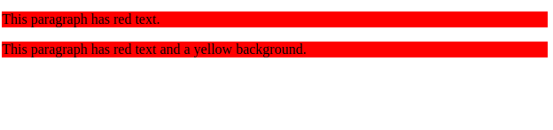
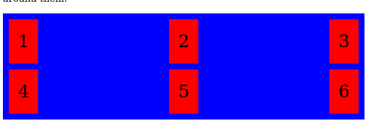

##  HTML AND CSS

### Box Model

Box Model is used to design and develop the structure of the webpages. It consists of many properties
* Height
* Width
* Padding
* Border
* Margin
  
Using these properties we can structure the layout of the container and the elements.


#### Height

Height specifies the height of the content area. It can be given using **height** property.
```
height:200px;
```
It sets the height of content area to 200px.

#### Width

Width specifies the width of the content area. It can be given using **width** property.
```
width:200px;
```
It sets the width of content area to 200px.

#### Border Field

 A border is a region between the padding and the margin of the container. This border allows use to cover the content and padding of the element.The dimensions of the border can be given by width and height.

 The css border property allows us to specify style,width and color of the element's border. 

 ```
 border:2px solid red;
 ```

 The above code specifies the border of 2px thickness and type of solid with color red.

 There are many border-styles which can be specified by  **border-style** property.

 * dotted - Gives you a dotted border.
 * dashed - Gives you a dashed border.
 * solid  - Gives a Solid border.
 * double - Gives a Double border.
 * none   -  Gives no border.
  ```
  border-style:dashed dotted solid double;

  ```
  The above line gives a element with top border as dashed, right border as dotted, bottom border as solid and left border as double border lines.

  The commonly used border styling properties are

  * border-color : Which specifies the color of the border.
  * border-width : Which specifies the thickness of the border.
  * border-style : which specifies the style of the border.
  * border-radius : Which specifies the corner radius of the border.
  
  #### Margin Field

  These are used to specify the gap between the elements.

  The properties which are used to specify the margins are

  * margin-top
  * margin-bottom
  * margin-left
  * margin-right

The shorthand property for the margin can be written as

```
margin: 20px 30px 40px 50px;
```
The above code gives a margin of 20px on the top, 30px to the right, 40px below the element and 50px to the left.

```
margin:20px;
```
It applies 20px as margin to all sides

```
margin:20px 30px;
```
It applies 20px to the top and bottom whereas 30px to the left and right of the element.
```
margin:auto;
```
It helps the element for horizontal alignment.

#### Padding

This area is the space around the content area and inside the border-box. The height and the width of the padding box decide its proportions. It helps to give gap around the element within the box.

The properties which are used to specify the padding are

  * padding-top
  * padding-bottom
  * padding-left
  * padding-right

The shorthand property for the padding can be written as

```
padding: 20px 30px 40px 50px;
```
The above code gives a padding of 20px on the top, 30px to the right, 40px below the element and 50px to the left.

```
padding:20px;
```
It applies 20px as padding to all sides

```
padding:20px 30px;
```
It applies padding of 20px to the top and bottom whereas 30px to the left and right of the element.

The total height for the element can be calculated as:

> Total element height = height + top padding + bottom padding + top border + bottom border + top margin + bottom margin.

The total width for the element can be calculated as:

> Total element width = width + left padding + right padding + left border + right border + left margin + right margin.

### Inline vs Block Level Elements

The **display** property is used to control layout of the element. It specifies how a element is displayed.

#### Inline Elements

Inline elements only occupies the space which is needed for the content. It doesn't take the new line.

Some of the inline elements are:-

> \<a>\
> \<span>\
> \<strong>\
> \<em>\
> \<input>\
> \<b>\
> \<i>


To change the display property to inline we can use **display:inline** property.

Eg:-

```
 <div> This is a example of <strong> strong inline </strong> element </div>
 ```
output for the above code is:


> This is a example of **strong inline** element.

#### Block Level Elements

These elements start in a new line and occupuies the entire width available.

Some of the block level elements are:-

> \<div> \
> \<section> \
> \<header> \
> \<p>\
> \<footer>\
> \<h1>\
> \<h2>\
> \<pre>\
> \\
> \<li>

To change the display property to block we set the **display:block** property.

Eg:-
```
<div> This is a example of <p>block level element</p> using paragraph tag.</div>
```
output of the above code is

> This is a example of \
> block level element \
> using paragraph tag.

The above example divides the contents to 3 elements. The paragraph tag starts in the new line and takes up the entire width available.

### Positioning: Relative/Absolute

The position property helps in positioning the element in a document.
By default the position property is set to **static**. Which says the document to position the elements in the order of the elements written.The position properties such as top,left,right and bottom do not work in the static postioning.

#### Relative Positioning

When you set the position property to relative it looks exactly same as static but we change them using top,left,right and bottom properties. In the relative positioning the element is taken out of the document flow.

Ex:-
```
<div style="background-color:red;height:50px"> Static element </div>
<div style="background-color:blue; position: relative; top: -30px; left:10px;"> Relative element </div>
```


The second element is overlaid on the top of 1st element and also it is moved to left of 10px. The entire tag element moves to top by 30px and to left by 10px.

Generally we do not use top, left ,right and bottom on the position relative as the element moves out of the document and overlays on the other element.

#### Absolute Positioning

Element with positon absolute are positioned relative to it's closest parent relative element. The element is taken out of the document and the other elements are positioned as the normal flow.

Eg:-
```
<div style="background-color:red;height:50px; margin-bottom:20px"> Static element </div>
<div style="background-color:blue; position: absolute;"> absolute element </div>
<div style="background-color: chartreuse;">After element</div>
```


The second element is taken out of the document as it is not present and the remaining elements are positioned normally. so we see the 2nd element is over-laying on the top of the third element.

If we use **top:0px** it will be positioned with respect to the nearest parent relative element and gives a gap of 0px on the top.


The image specifies the top is given as 0px and left is set to 10px with relative to html tag as no parent is given position as relative. The element moves to left of 10px and gives a gap of 0px with respect to \<html>.

### CSS structural classes

Structural pseudo-classes allow the selection of child elements present within the hierarchy of parent element. With the use of theses we can select first-child element, last-child element, alternate elements present under the parent element.

The list of structural classes are

#### 1. :first-child
It selects only the first child of selected tag from any of the parent tag.

```
<html>
<head>
<style>
p:first-child {
  background-color: blue;
}
</style>
</head>
<body>

<p>First child of body element.</p>
<p>Second child of body element.</p>

<div>
  <p>First paragraph child of div tag.</p>
  <p>Second paragraph child of div tag.</p>
</div>

</body>
</html>

```
output


#### 2. :nth-child(n)
:nth-child(n) applies to the elements that appear at the position given by n. The styling is applied to those elements which are appeared in the nth position in a parent tag(tree).

```
<html>
  <head>
  <style>
    p:nth-child(3) {
      background-color: blue;
    }
    </style>
  </head>
    <body>

      <p>First child of body element.</p>
      <p>Second child of body element.</p>
      <p> Third child of the body tag.</p>
      <p> Fouth child of the body tag.</p>

    <div>
      <p>First paragraph child of div tag.</p>
      <p>Second paragraph child of div tag.</p>
      <p>Third paragraph child of div tag.</p>
      <p>Fourth paragraph child of div tag.</p>
    </div>

    </body>
</html>
```
output:
For a given n=3


**Note:**

1. Here we can also give an expression for n such as 2n (to select only the even child) 2n+1 (to select the odd postion of the elements).
2. Similarly we can select the nth-child from the bottom using **:nth-last-child(n)**

#### 3 :last-child

The last child pseudo class represents the element that is at the end of its siblings in a tree structure.

Ex:
```
<html>
<head>
<style>
p:last-child {
  background-color: blue;
}
</style>
</head>
<body>

<p>First child of body element.</p>
<p>Second child of body element.</p>
<p> Third child of the body tag.</p>
<p> Fouth child of the body tag.</p>

<div>
  <p>First paragraph child of div tag.</p>
  <p>Second paragraph child of div tag.</p>
  <p>Third paragraph child of div tag.</p>
  <p>Fourth paragraph child of div tag.</p>
</div>
<div>
<p> last element of the 2nd div tag.</p>
</div>
</body>
</html>
```
output


#### 4 :only-child

Selects every specified tag element that is the only child of its parent.

```
<!DOCTYPE html>
<html>

<head>
    <style>
        p:only-child {
            background: blue;
        }
    </style>
</head>

<body>

    <div>
        <p>This is a paragraph.</p>
    </div>

    <div><span>span element.</span>
        <p>paragraph element in the div with span element.</p>
    </div>

</body>

</html>
```
output:


#### 5 :first-of-type

Under a common parent. It selects the first element of the one type of sibling.

```
<!DOCTYPE html>
<html>

<head>
    <style>
        p:first-of-type {
            background: red;
        }
    </style>
</head>

<body>

    <p>The first paragraph.</p>
    <p>The second paragraph.</p>
    <p>The third paragraph.</p>
    <p>The fourth paragraph.</p>
    <div>
        <p>The first paragraph in div.</p>
        <p>The second paragraph in div.</p>
        <p>The third paragraph in div.</p>
        <p>The fourth paragraph in div.</p>
    </div>
</body>

</html>
```
output:


**Note:-**

1. Similarly if we mention **p:last-of-type** it selects every \<p> element that is the last \<p> element of its parent
2. if we mention **p:nth-last-of-type(n)**  it selects every \<p> element that is in the nth last position \<p> element of its parent, counting from the last child.

### CSS class selectors

#### CSS tag selectors

To select a tag in styling we can simply mention \<tag_name>{ styling_properties }

Eg:-

```
<html>
  <head>
  </head>
  <body>
    <p class="red">This paragraph has red text.</p>
    <p id="yellow">This paragraph has text and a yellow background.</p>
  </body>
</html>


```
```
p{
  background-color:red;
}
```
output:


It selects all the \<p> tags and assigns background color as red.

#### CSS class selectors
It only selects the tags which has the mentioned class name preceding with **.**

For the above if we change the style to
```
.red{
  background-color:red;
}
```
output:


The element with the class having the value as red only changes the background-color.

#### CSS id selctors

To select the id names we use #id_name

Eg:-
```
<html>
  <body>
    <p class="red">This paragraph has red text.</p>
    <p id="yellow">This paragraph has red text and a yellow background.</p>
  </body>
</html>

```
```
#yellow{
  background-color:yellow;
}
```

output:


### CSS Specificity

Specificity is the process of determining which CSS property values are most relevant to an element and, as a result, will be used.

The following list of selector types increases by specificity:

1. Type selectors and pseudo-elements.
2. Class selectors, attributes selectors and pseudo-classes.
3. ID selectors.
4. Inline styles.

The universal selector (*) has low specificity, while ID selectors are highly specific.

if the element having same specificity then the latest one will be applied to that element.

Eg:-
```
div{ 
  color:red;
}

div{
  color:blue;
}
```
The color blue is applied to the **div** tag as it is written last (overrides the previous one.)


**specificity order:**

> tags \< class \< id \< inline styling

### Responsive Queries

Responsive queries helps us to style differently for different sizes of the devices.

We use **@media** rule to include css property for certain condition.

Example:-

```
body{
  background-color:green;
}
@media screen and (max-width:800px){
  /* CSS styling */
  body{
    background-color:red;
  }
}

@media screen and (max-width:480px){
  body{
    background-color:yellow;
  }
}

@media screen and (max-width:1200px){
  body{
    background-color:blue;
  }
}
```
* When the size of the screen is 1600px the background color of the screen will be green.
* When the screen size is less than 1200px and greater than 800px the background color of body will be blue.
* When the screen size is less than 800px and greater than 480px then the background color of the body will be changed to red.
* When the size of the screen is less than 480px the background color will be changed to yellow.

These media queries are very useful when you are desigining the website for multipile devices and it gives you flexibility to change the styles as per the dimensions.

**Note:**
1. We can also mention min-width in the media queries. In this case if minimum width condition is met the styles relating to that are applied to the webpage.


### Grid

The CSS Grid Layout Module offers a grid-based layout system, with rows and columns, making it easier to design web pages without having to use floats and positioning.

A grid layout consists of a parent element, with one or more child elements.

With the help of grid we can aligin elements in the row and column based order. We can also mention the area which it should be occupied.

A HTML element becomes a grid container when we set the property of display to grid as **display:grid**.


### Grid Properties

#### 1. grid-template-columns

It defines the number of columns to be in your grid layout. With the help of grid-templete-column we can specify the width of each item that it should be occupy.
Example:
```
<html>
<head>
<style>
  div {
    background-color: blue;
    border: 2px solid black;
    text-align: center;
    font-size: 30px;
  }
</style>
</head>
  <body>

    <div class="grid-container">
      <div>1</div>
      <div>2</div>
      <div>3</div>  
      <div>4</div>
      <div>5</div>
      <div>6</div>
      <div>7</div>
      <div>8</div>
    </div>
  </body>
</html>

```

```
.grid-container {
  display: grid;
  grid-template-columns: 1fr 1fr 1fr 1fr;
}
```
It makes a grid container with 4 columns each equal to same size (divides the screen into 4 fractions and each item is given a width of 1 fraction).


#### 2. column-gap

With the help of column-gap property we can mention the column gap between 2 items in a container.
```
column-gap:20px;

```


#### 3. row-gap

With the help of row-gap property we can mention the row-gap between 2 rows in a container.

```
row-gap:20px;
```


#### 4. grid-templete-row
It defines the number of rows to be in your grid layout. With the help of grid-templete-rows we can specify the height of each item that it should be occupy.

```
.grid-container {
  display: grid;
  grid-template-columns:1fr 1fr;
  grid-template-rows: auto auto auto auto;
  row-gap:20px;

}
```
It creates 2 columns and 4 rows in the container.


#### 5.  justify-content

The **justify-content** property is used to align the whole grid inside the container (horizontally).

The value **space-evenly** will give the columns equal amount of space between, and around them.

```
justify-content: space-evenly;
```


The value **space-around** will give the columns equal amount of space around them.
```
justify-content:space-around;
```


The value **space-between** will give the columns equal amount of space between them.

```
justify-content:space-between;
```


The value **center** will align in the middle of the container.
```
justify-content:center;
```


#### 6. align-content

The **align-content** property is used to align the whole grid inside the container (vertically). It is simliar to the justify-content but vertically aligns the items in the container.

#### 7. grid-column

The grid-column property specifies on which column the item should be placed.
```
.grid-container {
  display: grid;
  grid-template-columns:1fr 1fr 1fr;
  grid-gap: 10px;
  background-color: blue;
  padding: 10px;
}
.item1{
grid-column:1 /span 2;
}
```
item1 in the div tag takes 2 column space starting from 1st column and the remaining elements will align accordingly.


Similarly we can mention the **grid-row** property for the space that should be occupied by the items in the span of the rows.

```
 .item1 {
  grid-row: 1 / 4;
}
```
item1  will start on row-line 1 and end on row-line 4.

#### grid-area

It is a shorthand property to mention **grid-row** and **grid-column**.

```
.item1{
grid-area:1 / 2 / 5 / 6;
}
```
item1 starts in row 1 and column 2 and ends at row 5 and column 6.


**grid-area** property will allow us to position the items anywhere we want.

```

.item1 { grid-area: 1 / 3 / 2 / 4; }
.item2 { grid-area: 2 / 3 / 3 / 4; }
.item3 { grid-area: 1 / 1 / 2 / 2; }
.item4 { grid-area: 1 / 2 / 2 / 3; }
.item5 { grid-area: 2 / 1 / 3 / 2; }
.item6 { grid-area: 2 / 2 / 3 / 3; } 
```


### Header Meta Tags

The \<meta> tag defines metadata about an HTML document. Metadata is data about data.

The \<meta> tag always present inside the \<head> tag. It is used to specify character set, page description, keywords, author of the document, and viewport settings. It will not be displayed on the page. It is used by the browsers,search engines(keywords) and other web services.

Examples:-

#### To define keywords for search engines
```
<meta name="keywords" content="HTML, CSS, JavaScript">
```
#### To define a description of your web page
```
<meta name="description" content="web_practice">
```

#### To mention the author of the page
```
<meta name="author" content="DNSK Vamsi">
```

#### To refresh document every 30 seconds:
```
<meta http-equiv="refresh" content="30">
```

#### Setting the viewport to make your website look good on all devices
```
<meta name="viewport" content="width=device-width, initial-scale=1.0">
```
The viewport is the visible area of a web page. It varies with the device - it will be smaller on a mobile phone than on a computer screen.

The **width=device-width** part sets the width of the page to follow the screen-width of the device.

The **initial-scale=1.0** part sets the initial zoom level when the page is first loaded by the browser.

### References

* https://www.w3schools.com/css/css_rwd_mediaqueries.asp
* https://css-tricks.com/responsive-layouts-fewer-media-queries/
* https://www.w3schools.com/css/css_specificity.asp
* https://developer.mozilla.org/en-US/docs/Web/CSS/Specificity
* https://www.youtube.com/watch?v=jx5jmI0UlXU
* https://www.w3schools.com/css/css_grid.asp
* https://css-tricks.com/snippets/css/complete-guide-grid/
* https://developer.mozilla.org/en-US/docs/Web/CSS/CSS_Grid_Layout